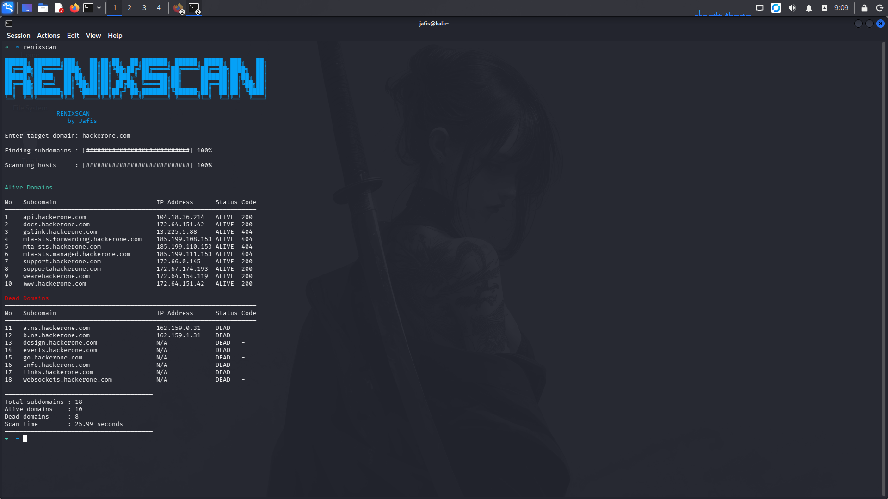

# 🐉 RenixScan

<p align="center">
   
</p>

### Advanced  Subdomain Scanner  
**Python Platform Recon Tool**

---

## 🔎 Description

**RenixScan** is a fast reconnaissance tool designed for **security researchers and bug bounty hunters**.

It enumerates subdomains using multiple tools and checks whether they are alive using **DNS resolution and HTTP requests**.

The tool provides **clean output with progress bars and organized tables**, making reconnaissance simple and efficient.

RenixScan uses **Subfinder** and **Assetfinder** to discover subdomains and then checks which hosts are alive.

---

## 🚀 Features

- ✅ Multi-source subdomain enumeration  
- ✅ Uses **Subfinder** and **Assetfinder**  
- ✅ Alive host detection  
- ✅ Displays **IP addresses**  
- ✅ HTTP **status code detection**  
- ✅ Multi-thread scanning  
- ✅ Progress bar interface  
- ✅ Clean organized output  


---

## 📦 Installation

Clone the repository

```
git clone https://github.com/jafis02-zero/RenixScan.git
```

Enter the directory

```
cd RenixScan
```

Run installer

```
chmod +x install.sh
sudo ./install.sh
```

---

## 📝 Usage

Run the tool:

```
renixscan
```

Enter your target domain when prompted:

🔗 Enter the Domain (eg: example.com): example.com

The tool will:

    Enumerate subdomains
    Validate live hosts
    Display IP addresses
    Show HTTP status codes
    Organize results into Alive and Dead domains
    Display scan statistics

---

## 🖥 Terminal Preview

<p align="center">
  
</p>

---

## 👨‍💻 Author

Jafis

LinkedIn  
https://www.linkedin.com/in/jafis-k-a-a73952389

---

## 🤝 Contributing

If you like **RenixScan**, please consider giving the repository a ⭐

🐉 RenixScan — Unleash the power of deep domain reconnaissance. 🚀
